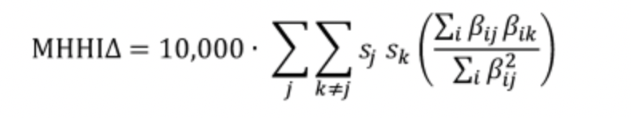

# MHHI-Delta

**Explanation**

MHHI Delta is an antitrust measure for an industry which incorporates the degree to which common ownership may lead to market collusion. Common ownership is the concept that competitors who share the same owner have an incentive to maximise industry profits rather than firm profits. For instance, an investor who has an ownership stake in multiple firms operating within the same industry does not want those firms to compete on price if doing so comes at the expense of overall industry profitability.

The code is a Python build of the following explanation and worked example of MHHI Delta: https://truthonthemarket.com/2018/08/16/lowering-the-barriers-to-entry-to-the-common-ownership-debate-a-relatively-non-technical-explanation-of-mhhi-delta/ 

**Environment**

- 3.9.2 Python Installation
- 1.2.4 Pandas Module 

**Formula**

          
- β_ij is the fraction of shares in firm j controlled by investor i,
- β_ik is the fraction of shares in firm k controlled by investor i,
- s_j is the market share of firm j, 
- s_k is the market share of firm k,
